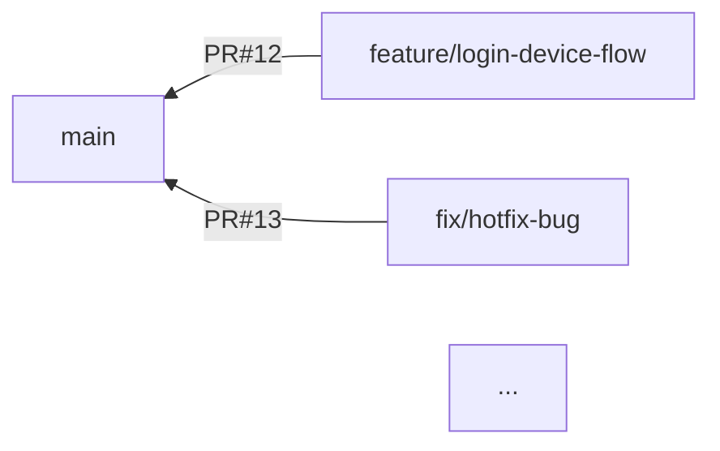

# Pull Request Graph

Pull Request とブランチを取得し、Mermaid 形式で可視化する Node.js ツールです。
GitHub Device Flow を用いることで、プライベートリポジトリにも対応可能です。

## インストール

```bash
npm install -g <このパッケージ名>
```

> グローバルインストールを行うことで、どのディレクトリからでもコマンドを呼び出せるようになります。
> ローカルインストールで使う場合は、本プロジェクトのディレクトリへ移動して `npm install --save-dev` を実行してください。

## 使い方

**リポジトリのあるディレクトリでコマンドを実行**

```bash
<このパッケージ名>
# または
npx <このパッケージ名>
```

- もしくは、パッケージをクローンして `npm run start` のように実行する方法もあります。

**`index.html` が生成 → ブラウザ表示**

- 実行後に、同じディレクトリに `index.html` が生成されます。
- そのまま自動的にブラウザが起動する場合もあれば、起動しない場合はファイルを手動で開いてください。

## 出力例

生成される `index.html` の中身（Mermaid 部分のみ抜粋）:



ブラウザで開くと、矢印や PR 番号、ブランチ名が可視化されて確認できます。
ブランチ名をクリックすると、PR のページにアクセスできます。

## コントリビュート

- バグ報告やプルリクエストは歓迎です。
- Issue や Pull Request でお気軽にご連絡ください。

## ライセンス

[MIT License](LICENSE)
