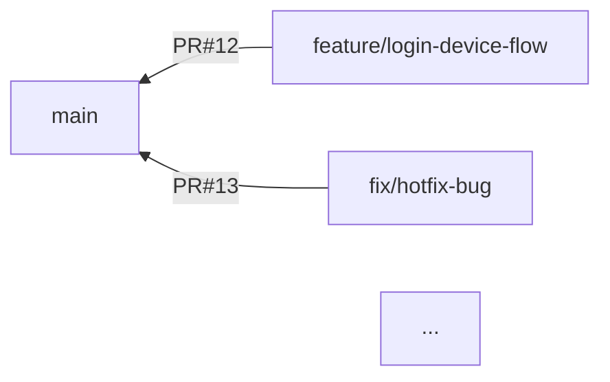

# Pull Request Graph

Pull Request とブランチを取得し、Mermaid 形式で可視化する Node.js ツールです。
GitHub Device Flow を用いることで、プライベートリポジトリにも対応可能です。

## 特徴

- **Git リポジトリの `origin` からリポジトリ情報を自動取得**
  `git remote get-url origin` を利用し、対象のリポジトリを自動的に判定します。

- **プライベートリポジトリ対応**
  GitHub の Device Flow 認証により、実行時にブラウザでログインするだけでプライベートリポジトリへのアクセスが可能です。
  環境変数や PAT（Personal Access Token）を事前に用意しなくても OK。

- **Mermaid グラフ生成**
  Pull Request (PR) のベースブランチとヘッドブランチの関係をグラフ（`graph LR`）として自動生成。
  生成した `index.html` をブラウザで開くと、Mermaid の可視化グラフが表示されます。

- **ブラウザ自動起動**（オプション）
  ローカルで `index.html` を生成した後、`open` パッケージを利用して OS に依存せずデフォルトブラウザを起動できます。

## インストール

```bash
npm install -g <このパッケージ名>
```

> グローバルインストールを行うことで、どのディレクトリからでもコマンドを呼び出せるようになります。
> ローカルインストールで使う場合は、本プロジェクトのディレクトリへ移動して `npm install` を実行してください。

## 使い方

1. **GitHub OAuth App を準備（プライベートリポジトリを扱う場合）**

   - [OAuth App](https://docs.github.com/ja/apps/oauth-apps/building-oauth-apps/creating-an-oauth-app) を作成し、Device Flow に対応した **Client ID** を確認。
   - ソースコード内の `GITHUB_CLIENT_ID` をご自身の OAuth App クライアント ID に置き換えてください。

2. **Git リポジトリへ移動**

   ```bash
   cd /path/to/your-repo
   ```

3. **コマンドを実行**

   ```bash
   # グローバルにインストールした場合は直接呼び出せます

   ```

   - もしくは、パッケージをクローンして `npm run start` のように実行する方法もあります。

4. **デバイスフローで認証（プライベートリポジトリの場合）**

   - ターミナルに「User Code」「ブラウザでアクセスすべき URL」が表示されます。
   - ブラウザでその URL を開き、User Code を入力 →GitHub アカウントでログイン → 権限付与。
   - 認証が完了すると、コマンドが自動的にアクセストークンを取得し、PR 一覧の取得が続行されます。

5. **`index.html` が生成 → ブラウザ表示**
   - 実行後に、同じディレクトリに `index.html` が生成されます。
   - そのまま自動的にブラウザが起動する場合もあれば、起動しない場合はファイルを手動で開いてください。

## 出力例

生成される `index.html` の中身（Mermaid 部分のみ抜粋）:



ブラウザで開くと、矢印や PR 番号、ブランチ名が可視化されて確認できます。

## 使用例

```bash
# 1. Node.jsプロジェクトとしてセットアップ（ローカルの場合）
git clone https://github.com/haruo2177/PullRequestGraph
cd PullRequestGraph
npm install

# 2. プロジェクト直下のリポジトリを対象としてコマンドを実行
node run start

# → ブラウザでPR一覧のグラフが表示！
```

## 必要な権限

- **パブリックリポジトリのみ**であれば、未認証でも動作しますが、レートリミットが厳しい（1 時間に 60 回）点に注意してください。
- **プライベートリポジトリを扱う場合**は、Device Flow で認証し、少なくとも `repo` スコープの権限が必要です。

## コントリビュート

- バグ報告やプルリクエストは歓迎です。
- Issue や Pull Request でお気軽にご連絡ください。

## ライセンス

[MIT License](LICENSE) など、お好みに合わせて設定してください。
